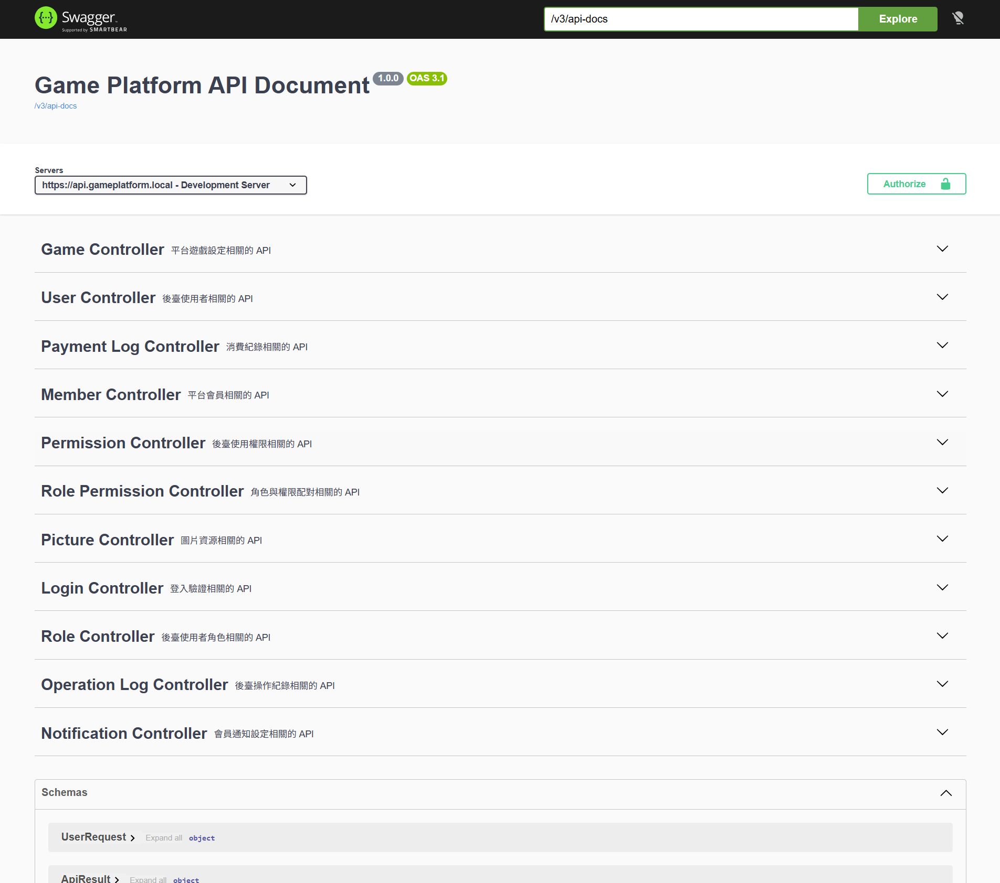
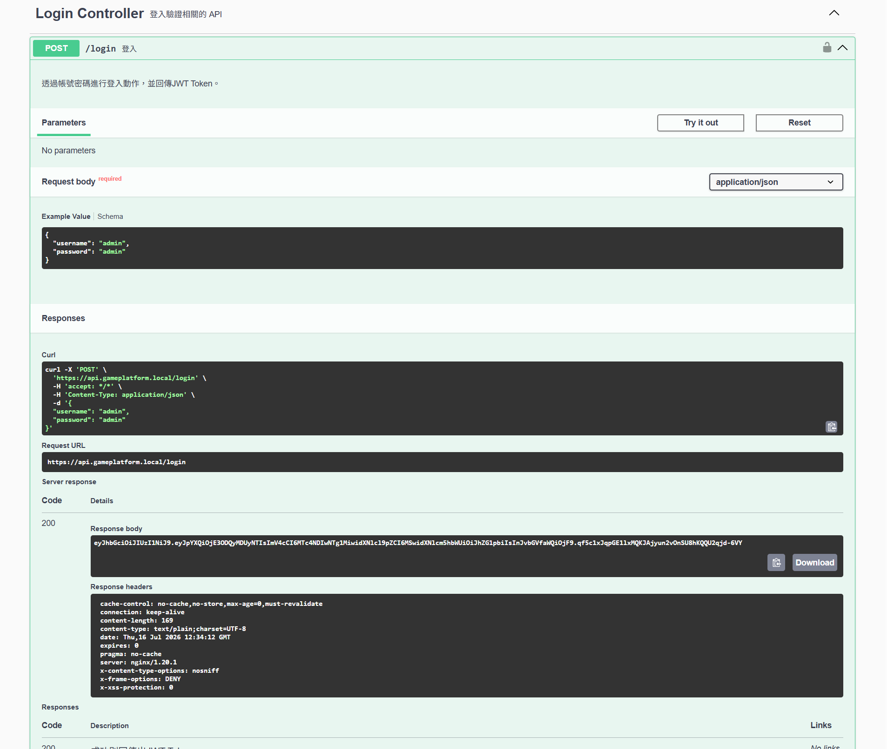
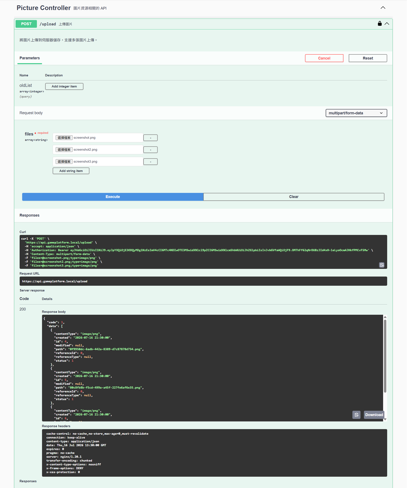
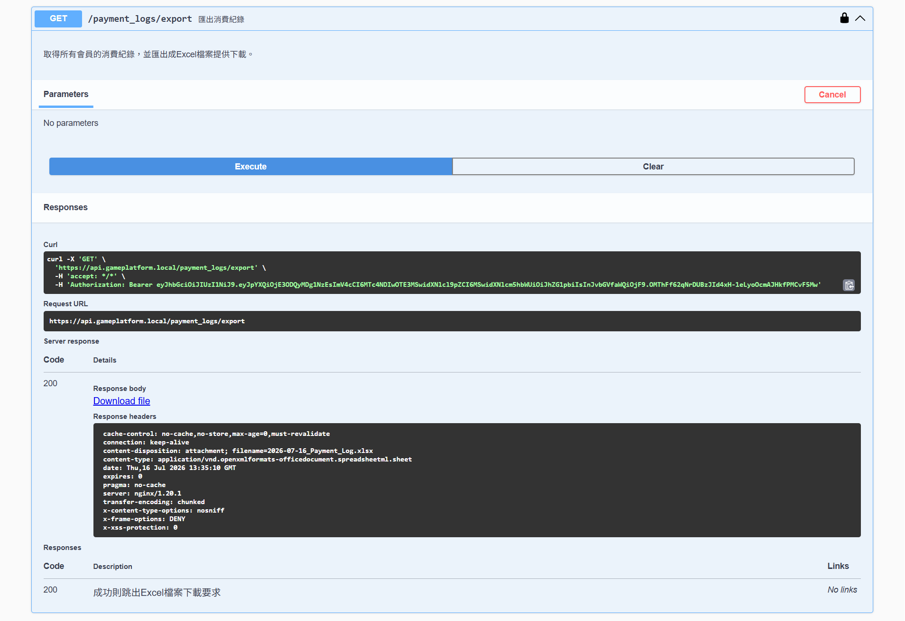
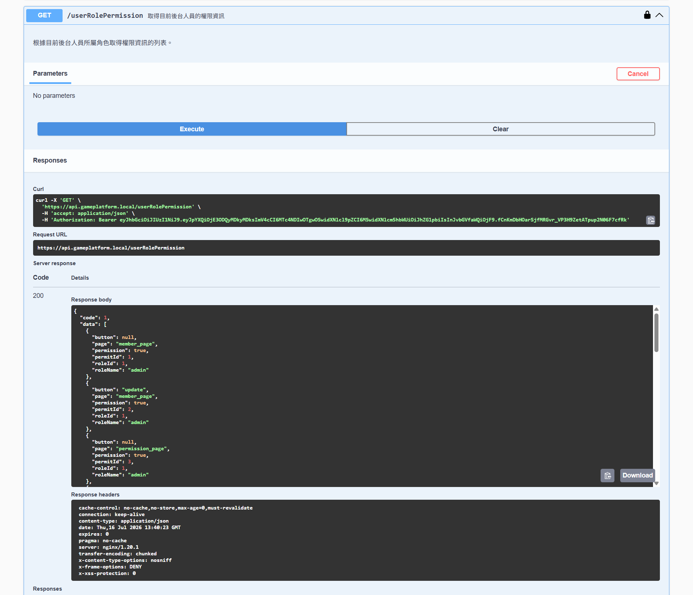
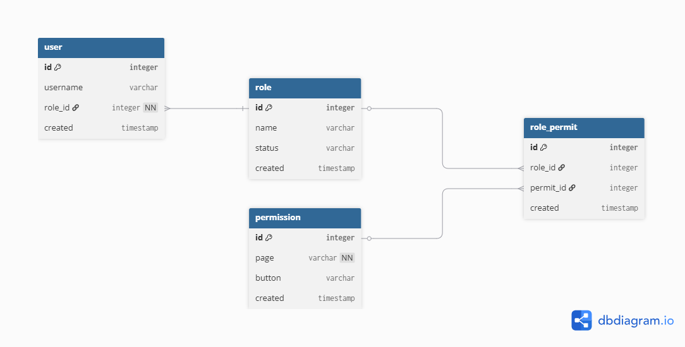

# Game Platform API


## Overview

Game Platform API is a backend management system developed with Spring Boot.

This project provides RESTful APIs for game management, member management,
role-based permission control, purchase records, notification settings,
and backend operation logging.

The system includes authentication, authorization, file upload,
Excel export, email notification, and API documentation.


## Tech Stack

### Backend

- Java 17
- Spring Boot 4.1.0
- Maven
- Spring MVC
- Spring JDBC


### Security

- Spring Security
- JWT Authentication
- Role-Based Access Control (RBAC)
    - Role Permission
    - Page Permission
    - Button Permission


### Database

- MySQL 8
- MySQL Connector/J


### API Documentation

- SpringDoc OpenAPI
- Swagger UI


### Libraries

- JJWT
    - JWT Token generation and validation

- Apache POI
    - Excel export

- Spring Mail
    - Email notification

- Thymeleaf
    - Email template rendering

- Spring AOP
    - Backend operation logging


## Features

### 1. Authentication

- JWT Login API
- Spring Security authentication
- Generate JWT access token


### 2. Member Management

- Member CRUD API
- Member status management


### 3. Game Management

- Game CRUD API
- Game category management
- Upload game images


### 4. Notification Settings

- Email notification settings
- Email sending service integration
- Thymeleaf email template support


### 5. Backend Operation Log

- Record administrator operations
- Request information logging
- Implemented with Spring AOP


### 6. Purchase Records

- Purchase history management
- Excel export functionality
- Apache POI integration


### 7. Role Permission Management

- Role management
- Page permission control
- Button permission control


### 8. Game Type Management

- Game category CRUD API


### 9. API Documentation

- Swagger UI integration
- OpenAPI specification


## Project Structure
src/main/java/com/shuinvy/game_platform
```
├── controller
│ └── REST API Controllers
│
├── service
│ └── Business Logic
│
├── dao
│ └── Database Access Layer
│
├── model
│ └── Database Entities
│
├── rowmapper
│ └── Mapping for model and database columns
│
├── dto
│ └── Request / Response Objects
│
├── security
│ └── JWT Authentication
│
├── filter
│ └── JWT Authentication Filter
│
├── aspect
│ └── Operation Logging
│
├── config
│ └── Application Configuration
│
├── common
│ └── Utility Classes
│
└── constant
    └── Constant Classes
```
## Database Setup
Requirements

MySQL 8+

### Create Database
CREATE DATABASE game_platform;


### Initialize Database

Import SQL file:

database/game_platform.sql

The database includes:
```
Administrator tables
Role and permission tables
Member tables
Game tables
Picture (Resource Management) tables
Purchase record tables
Notification setting tables
Operation log tables
```
## Configuration in YAML File

Before running the project, update:

src/main/resources/application.yaml

Configure the following settings:

### Database
```
spring:
  datasource:
    url: jdbc:mysql://localhost:3306/game_platform
    username: your_username
    password: your_password
```
### JWT
```
jwt:
  secret: your_secret_key
  valid-seconds: 3600
```
### Mail
```
spring:
  mail:
    username: your_email
    password: your_mail_application_password
```
For local development, it is recommended to use:

application-local.yaml

Keep sensitive information out of version control.

## Run Project

### Requirements
JDK 17+
Maven
MySQL 8+

### Start Application
Using Maven:

mvn spring-boot:run

Or build and run:

mvn clean package

java -jar target/game_platform-0.0.1.jar

## API Documentation

After starting the application, access Swagger UI:

http://localhost:8080/swagger-ui/index.html

Swagger provides API documentation and testing interface for:

Authentication API
Member API
Game API
Permission API
Purchase API
Notification API

## Screenshots
### Swagger API Documentation



### Login API



### Upload API



### Export Excel API



### Role API



### RBAC ER DIAGRAM



## Docker Run

Default:
```bash
docker run -p 8080:8080 shuinvy/game-platform:0.0.1
```

Override settings:

Sensitive configurations should be provided through environment variables or external configuration files in production environments.

```bash
docker run -d \
--name game-platform \
-p 8080:8080 \
-e DB_USERNAME=<db-username> \
-e DB_PASSWORD=<db-password> \
-e EMAIL_PASSWORD=<your-email-password> \
-e JWT_SECRET_KEY=<your-secret-key> \
shuinvy/game-platform:0.0.3 \
--spring.mail.username=<your-email@gmail.com>
```

## Future Improvements
- Backend Permission Authorization
  - Integrate Spring Security authorization mechanism
  - Move permission validation from frontend to backend API layer
- Refresh Token API
- Statistics API
- SMS Notification
- Timezone-aware Date and Time Handling
  - Store timestamps in UTC format
  - Convert UTC time to user's local timezone when displaying
- Transactional Handling
- Swagger with i18n
- Reorganize the directory structure
  - Function based first, then MVC
  - Such as: member/controller/, member/service
- Container Deployment Enhancement
  - Docker Compose deployment
  - Nginx reverse proxy configuration
  - HTTPS deployment
- CI/CD Pipeline
- Unit Test / Integration Test
- API Rate Limiting
- Message Queue (RabbitMQ / Kafka)
- Search / Pagination for List

## Author
Shuinvy
